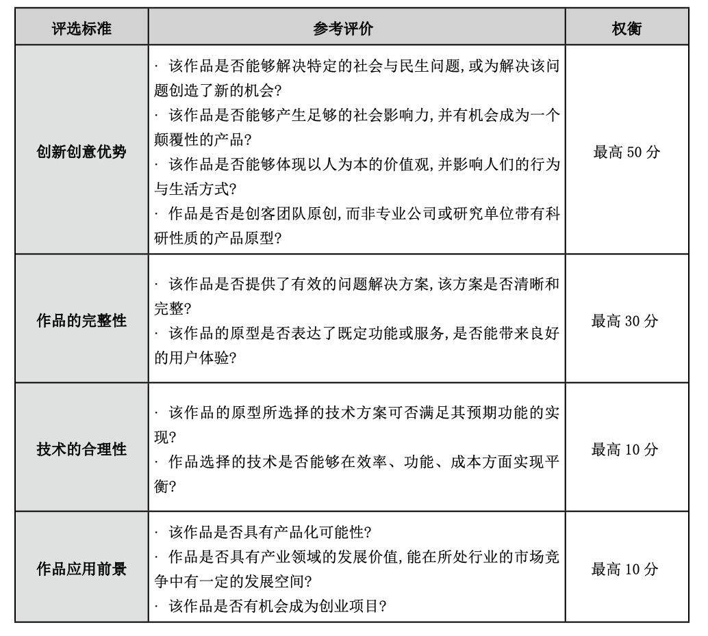
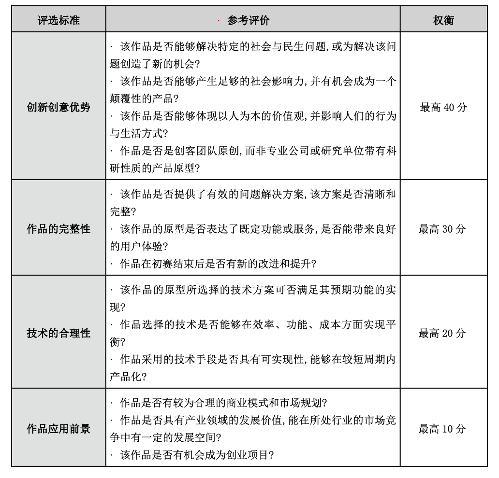

#### 2020 共创未来—中美青年创客大赛说明

 

1. 大赛主办方与承办方
   
   2020 年中美青年创客大赛由中华人民共和国教育部主办,中国(教育部)留学服务中心、清华大学、 北京歌华文化发展集团、谷歌信息技术(中国)有限公司和中国大学科技园联盟共同承办。上海分区选拔赛由上海交通大学等承办。

2. 报名要求

    （1）以团队形式报名时,团队总人数不得超过 5 人(含领队),领队为团队的联系人和代表。

    （2）分赛区选拔赛开始前,团队可替换一位或多位成员,领队不可更换。

    （3）每个参赛项目可至多有一位指导老师,指导老师不得再以领队或者成员身份参赛。

    （4）一名参赛者只可以个人或团队形式参与到一个项目之中。

    （5）参赛个人或团队需在报名时签署中美青年创客大赛参赛者声明，报名成功后则视为参赛个人或团队完全接受本大赛参赛者声明。

3. 参赛作品要求
   
    (1)竞赛主题要求:大赛倡导参赛者以促进社会可持续发展作为竞赛主题,关注社区、教育、环保、 健康、能源、交通等领域,产生的创意需契合比赛主题,并通过结合创新理念和前沿科技,打造具有社会 意义和产业价值的作品。大赛将特别关注作品在社会与民生方面的贡献。

    (2)竞赛创新性要求:团队可在比赛过程中对作品进行持续的改进,提交的解决方案须具有想象力和 创新性;大赛工作组和各分赛区选拔赛承办单位将对其产品进行创新性检索,并将检索结果提交评审工 作组作为评分参考。

    (3)作品呈现要求:作品原型要求基于开源软件或开源硬件平台完成。参赛者需要在分赛区预选赛 阶段现场完成设计工作,并制作出可演示的产品原型。从分赛区预选赛晋级决赛的团队,需要在决赛阶 段现场完成针对产品原型的改进、升级和测试等工作。作品原型应呈现为实现一定创新功能的硬件或 软件。
    
    (4)技术平台要求:工作组将提供大赛可采用的竞赛技术平台的参考方案,参赛者也可自行选择技术 平台和使用相应的工具和设备(详见附件 2:中美青年创客大赛推荐技术平台清单)。

4. 评审标准
   
   1）分赛区选拔赛
   
    
   2)决赛
    

5. 奖项设置
   
   1）分赛区选拔赛

        1 个一等项目奖励(最高得分)
        2 个二等项目奖励(排名第二和第三的最高得分)
        2 个三等项目奖励(排名第四和第五的最高得分)
        
    2）决赛

        1 个特等项目奖励(最高得分),奖金人民币壹拾万元整(¥100,000)。
        3 个一等项目奖励(排名第二、第三和第四的最高得分),奖金人民币伍万元整(¥50,000)。
        6 个二等项目奖励(排名第五、六、七、八、九、十的最高得分),奖金人民币叁万元整(¥30,000)。

6. 上海赛区时间节点

7. 报名网址
   
   [摩课云：中美青年创客大赛](https://cc.moocollege.com/#/details?id=2089)

[link1]:https://www.baidu.com

[link2]:https://www.baidu.com

[link3]:https://www.baidu.com

参考资料：

1. [2020 共创未来—中美青年创客大赛 竞赛章程][link1]

   
2. [2020年中美青年创客大赛上海赛区赛务方案][link2]
   
3. [中美青年创客大赛报名指南][link3]
